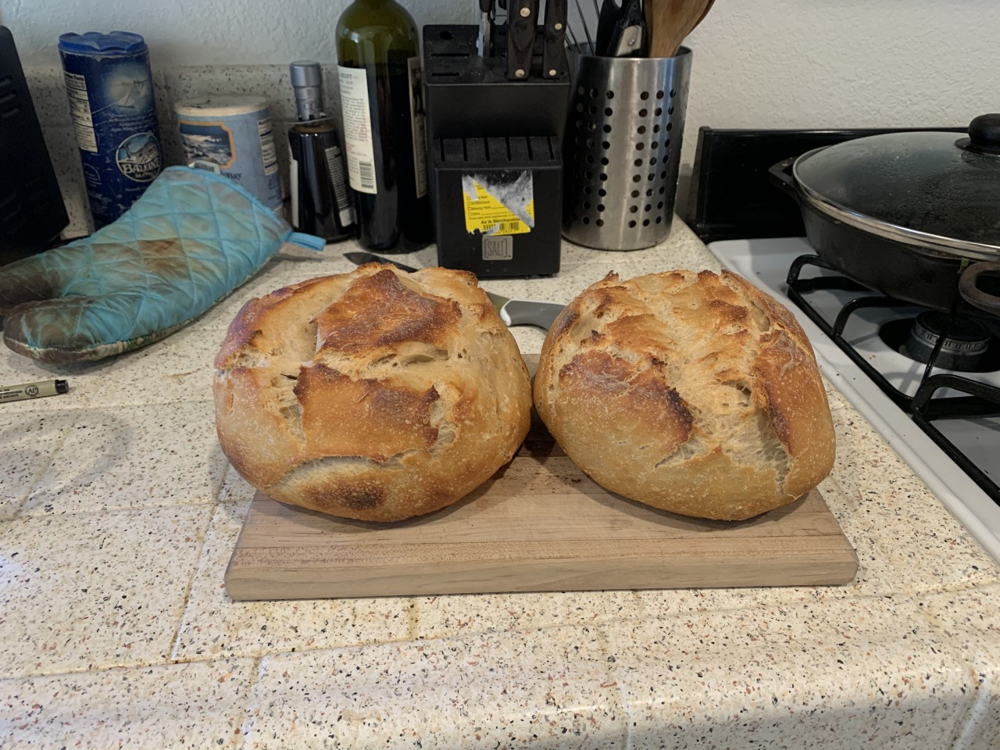

## Tartine

This is the second bread recipe I have followed and it went reallly well.  I got the general recipe from [here](https://www.homemadefoodjunkie.com/tartine-style-sourdough-bread-recipe/)

Inline-style: 

The recipe is as follows.

### Ingredients

- 525 g (2.22 cups) water
- 20 g (1 tbsp) salt
- 200 g (1+ cup) sourdough starter
- 700 g (5.5 cups) flour
  - I used half white and half whole wheat all purpose flour

### Steps

- Add water to starter, whisk
- Add flour, mix: use hands to form "shaggy dough ball"
- Autolyse 1 - 4 hours
- Add Salt
- Stretch and fold every half hour 5x (total of 2.5 hours)
  - I think I did four, doesn't really matter I don't think
- Let rise til volume increases about 30%
- Can let rise in fridge overnight 
- Split into 2 dough balls and let site half hour
- Flip stretch and fold
- Recipe says to rest in firdge 2-4 hours
  - I let rest on counter for one hour
- Preheat oven to 450 and preheat dutch oven
- Place dough ball on parchment paper
- Bake 30 mins with lid on, 10 minutes lid off
- Repeat with second loaf
